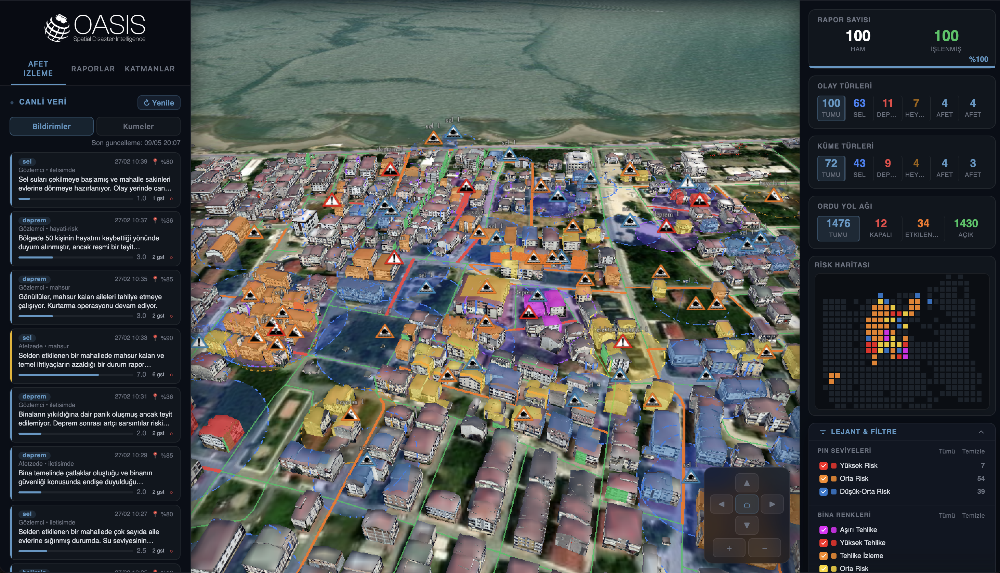
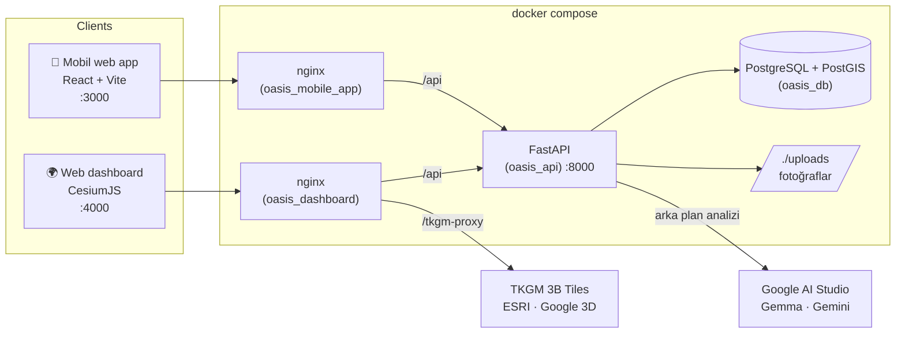
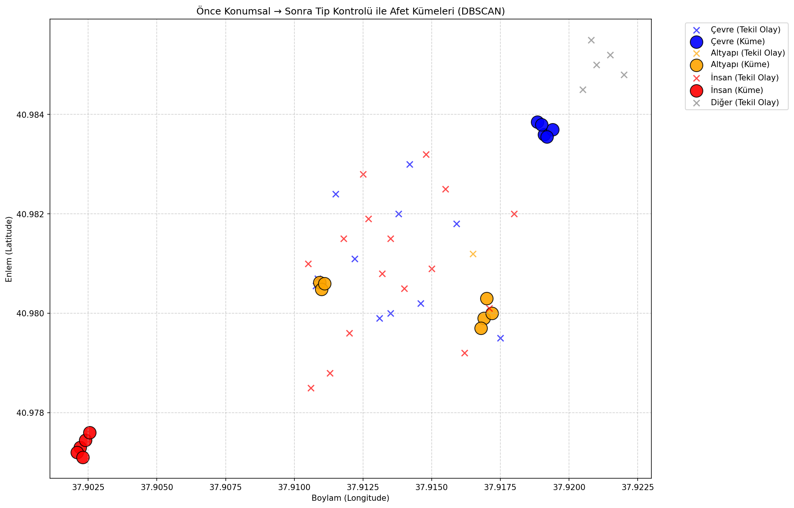
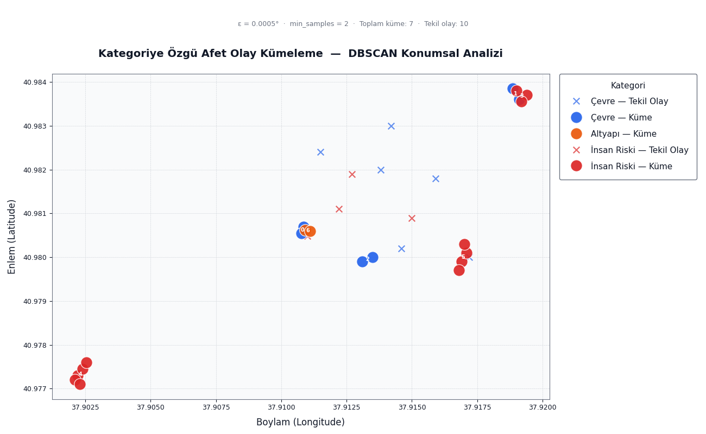

# OASIS — AI-Assisted Disaster Management System

> **Open Awareness System for Incident Support**
> Yapay zekâ destekli vatandaş ihbar uygulaması ve gerçek zamanlı 3B afet yönetim paneli.



OASIS, afet anında vatandaşlardan gelen ihbarları (metin + fotoğraf + konum) toplayan, yapay zekâ ile analiz eden, konumsal olarak kümeleyen ve karar vericilere 3B harita üzerinde sunan uçtan uca bir platformdur.

- 📱 **Mobil web uygulaması** — tarayıcıdan çalışan, telefona "ana ekrana ekle" ile yüklenebilen ihbar arayüzü
- 🤖 **Gösterge tabanlı AI analizi** — Gemma (metin) + Gemini (görsel) 18 boolean gösterge üretir, aciliyet puanı deterministik formülle hesaplanır
- 📍 **Afet kümeleme** — PostGIS + DBSCAN ile yakın ihbarlar olay kümelerine bağlanır
- 🌍 **3B WebGIS paneli** — CesiumJS, TKGM 3B bina katmanları ve yol ağı üzerinde canlı ihbar/küme görünümü

---

## Hızlı Başlangıç

Gereksinimler: [Docker Desktop](https://www.docker.com/products/docker-desktop/) (Compose v2.24+) ve ücretsiz bir [Google AI Studio API anahtarı](https://aistudio.google.com/apikey).

```bash
git clone https://github.com/kaanklcrsln/oasis-dev.git
cd oasis-dev

cp .env.example .env          # Windows PowerShell: Copy-Item .env.example .env
# .env dosyasını açıp GEMINI_API_KEY=... satırını doldurun

docker compose up -d --build
```

| Servis | Adres | Container |
|--------|-------|-----------|
| Mobil web uygulaması | http://localhost:3000 | `oasis_mobile_app` |
| 3B Web dashboard | http://localhost:4000 | `oasis_dashboard` |
| API + Swagger dokümantasyonu | http://localhost:8000/docs | `oasis_api` |
| PostgreSQL + PostGIS | `localhost:5432` (yalnızca yerel) | `oasis_db` |

**Örnek veri yüklemek için** (100 test ihbarı + 58 örnek fotoğraf):

```bash
python scripts/populate_reports.py            # sadece yükle
python scripts/populate_reports.py --analyze  # + AI analizini arka planda başlat
```

Aynı işlem dashboard'daki **Raporları Yükle** butonuyla da yapılabilir. AI analizinin ilerleyişi: `docker compose logs -f api`.

> `GEMINI_API_KEY` girilmeden de sistem çalışır; ihbarlar kaydedilir ancak AI analizi atlanır (`/health` → `"ai_enabled": false`).

### Opsiyonel servisler

```bash
docker compose --profile tools up -d    # pgAdmin → http://localhost:5050
docker compose --profile tunnel up -d   # Cloudflare Tunnel (CLOUDFLARE_TOKEN gerekir)
```

### Durdurma / sıfırlama

```bash
docker compose down        # servisleri durdur (veri korunur)
docker compose down -v     # veritabanı dahil her şeyi sil
```

---

## Mimari



Her iki arayüz de API'ye kendi nginx'i üzerinden **aynı origin** ile erişir; tarayıcıda CORS veya API adresi ayarı gerekmez.

### Veri akışı

1. Vatandaş mobil uygulamada ihbar oluşturur (mağdur/gözlemci, açıklama, opsiyonel fotoğraf, GPS).
2. `POST /api/reports/` → `raw_reports`; yakın bir afet kümesi varsa yanıtta uyarı döner.
3. Fotoğraf `POST /api/reports/{id}/image` ile yüklenir → EXIF çıkarılır (`exif_file`), 1920 px / JPEG %85 olarak sıkıştırılır.
4. Arka plan görevi: **LLM** (Gemma, metin) ve **VLM** (Gemini, görsel) 18 boolean gösterge üretir.
5. `indicator_scoring.py` göstergelerden 1–10 aciliyet puanı, kullanıcı durumu ve önerilen aksiyonu **deterministik** olarak hesaplar → `processed_reports`.
6. `cluster_service.py` raporu PostGIS/DBSCAN ile `disaster_clusters` içine yerleştirir; dashboard 3B harita üzerinde gösterir.

Ayrıntılı pipeline diyagramı: [docs/ai-pipeline.md](docs/ai-pipeline.md)

---

## Proje Yapısı

```
.
├── backend/                FastAPI servisi
│   ├── app/
│   │   ├── routes/         reports.py, clusters.py
│   │   ├── services/       ai_service, indicator_scoring, cluster_service, exif_service, image_service
│   │   ├── config.py       .env tabanlı ayarlar
│   │   ├── models.py       SQLAlchemy + GeoAlchemy2 modelleri
│   │   └── main.py
│   ├── seed/               test_reports.json + örnek fotoğraflar
│   └── Dockerfile
├── mobile_app/             Mobil web uygulaması (React 18 + TypeScript + Vite + Leaflet)
│   ├── src/                screens/, components/, lib/
│   ├── nginx.conf          statik yayın + /api proxy
│   └── Dockerfile
├── dashboard/              3B WebGIS paneli (CesiumJS, statik)
│   ├── data/               Akyazı binaları, Ordu yol ağı (GeoJSON)
│   ├── nginx/              nginx şablonu: /config.js, /api ve TKGM proxy
│   └── Dockerfile
├── database/init.sql       PostGIS şeması (ilk açılışta otomatik uygulanır)
├── ai_engine/              Bağımsız AI prototip scriptleri
├── analysis/               Model doğrulama deneyleri ve çıktıları (outputs/)
├── scripts/                Veri üretme / yükleme yardımcı scriptleri
├── data/                   Ham ve türetilmiş veri setleri
├── images/                 README ve rapor görselleri
├── assets/                 Logo ve NAPSG afet ikon seti
├── docs/                   Pipeline dokümanı, posterler
├── docker-compose.yml
└── .env.example
```

---

## Yapılandırma

Tüm ayarlar kökteki `.env` dosyasından okunur ([.env.example](.env.example)). **Zorunlu olan tek değer `GEMINI_API_KEY`'dir.**

| Değişken | Varsayılan | Açıklama |
|----------|-----------|----------|
| `GEMINI_API_KEY` | — | Google AI Studio anahtarı (zorunlu) |
| `GEMMA_LLM_MODEL` | `gemma-4-31b-it` | Metin analizi modeli |
| `GEMMA_LLM_FALLBACKS` | `gemma-3-27b-it,gemma-3-12b-it` | Kota dolunca denenecek modeller |
| `GEMINI_VLM_MODEL` | `gemini-2.5-flash` | Görsel analizi modeli |
| `TEXT_ONLY_GEMMA_MODE` | `true` | `false` yapılırsa fotoğraflar da VLM ile analiz edilir |
| `POSTGRES_USER` / `POSTGRES_PASSWORD` / `POSTGRES_DB` | `oasis_user` / `oasis_secret` / `oasis` | Veritabanı kimlik bilgileri |
| `API_PORT` / `DASHBOARD_PORT` / `MOBILE_APP_PORT` | `8000` / `4000` / `3000` | Host portları |
| `GOOGLE_MAPS_API_KEY` | boş | Dashboard'da Google Photorealistic 3D Tiles katmanı |
| `CESIUM_ION_TOKEN` | boş | Cesium World Terrain (boşsa CesiumJS varsayılan token'ı) |
| `CLOUDFLARE_TOKEN` | boş | `--profile tunnel` ile Cloudflare Tunnel |

> Dashboard anahtarları nginx tarafından çalışma anında `/config.js` olarak tarayıcıya verilir; kaynak koda yazılmaz. Tarayıcıya giden anahtarları Google Cloud Console'dan **HTTP referrer** ile kısıtlamanız önerilir.

---

## Mobil Uygulamayı Telefonda Kullanmak

Uygulama `http://<bilgisayar-ip>:3000` adresinden telefonda açılabilir. Tarayıcılar **konum iznini yalnızca HTTPS veya localhost** üzerinde verir; HTTP üzerinden açıldığında uygulama olay yerini haritadan seçtirmek için otomatik olarak konum seçiciye geçer. Gerçek GPS için uygulamayı HTTPS arkasında yayınlayın (ör. `--profile tunnel` ile Cloudflare Tunnel).

- Fotoğraf butonu telefonda doğrudan arka kamerayı açar, masaüstünde dosya seçici açılır.
- İnternet yoksa ihbar cihazda saklanır ve bağlantı gelince otomatik gönderilir.
- Tarayıcı menüsünden **Ana ekrana ekle** ile uygulama gibi kullanılabilir.

---

## Geliştirme (Docker olmadan)

```bash
# Veritabanı yine Docker'da
docker compose up -d db

# Backend
cd backend
python -m venv .venv && source .venv/bin/activate   # Windows: .venv\Scripts\activate
pip install -r requirements.txt
IMAGES_DIR=../uploads DEBUG=true python run.py      # http://localhost:8000

# Mobil web uygulaması (ayrı terminal) — /api istekleri localhost:8000'e proxy'lenir
cd mobile_app
npm install
npm run dev                                         # http://localhost:3000
```

Araştırma scriptleri (`analysis/`, `ai_engine/`, `scripts/`) için: `pip install -r requirements-analysis.txt`.

---

## API

Tam liste ve deneme arayüzü: http://localhost:8000/docs

| Method | Endpoint | Açıklama |
|--------|----------|----------|
| `POST` | `/api/reports/` | Yeni ihbar; AI analizi arka planda başlar, yakın küme bilgisi döner |
| `POST` | `/api/reports/{report_id}/image` | Fotoğraf yükler, EXIF çıkarır, sıkıştırır |
| `POST` | `/api/reports/{report_id}/exif` | İstemci tarafı EXIF/konum verisi |
| `GET` | `/api/reports/` | Tüm ihbarlar (AI sonuçlarıyla birlikte) |
| `GET` | `/api/reports/{report_id}/detail` | Ham + işlenmiş + EXIF detay |
| `DELETE` | `/api/reports/{id}` | İhbarı siler |
| `POST` | `/api/reports/analyze-all` | Analiz edilmemiş ihbarları sırayla analiz eder |
| `POST` | `/api/reports/cluster-all` | Kümeleri DBSCAN ile baştan kurar |
| `POST` | `/api/reports/admin/populate-test-data` | Tabloları sıfırlar, test verisini yükler |
| `GET` | `/api/clusters/nearby?lat=&lon=&radius=` | Yakındaki aktif afet kümeleri |
| `GET` | `/health` | Sağlık kontrolü |

---

## Veritabanı

PostgreSQL 15 + PostGIS 3.4. Şema [`database/init.sql`](database/init.sql) ile ilk açılışta oluşturulur.

| Tablo | İçerik |
|-------|--------|
| `raw_reports` | Uygulamadan gelen ham ihbar (konum, metin, fotoğraf yolu) |
| `processed_reports` | AI çıktısı: afet türü, aciliyet puanı, göstergeler (JSONB) |
| `exif_file` | Fotoğraf EXIF metadatası (GPS, cihaz, tarih) |
| `disaster_clusters` | Afet kümeleri (merkez, yarıçap, ortalama aciliyet) |
| `cluster_reports` | Küme ↔ ihbar ilişkisi |

---

## Analiz ve Doğrulama

`analysis/` klasöründeki deneyler AI pipeline'ının güvenilirliğini ölçer; çıktı grafikleri `analysis/outputs/` altındadır:

- **Known-answer test** — bilinen etiketli raporlarda gösterge doğruluğu
- **Internal consistency** — mantıksal tutarlılık ve tekrar kararlılığı
- **Perturbation robustness** — yazım hatası/eşanlamlı değişikliklere dayanıklılık
- **Multi-model consensus** — farklı modeller arası uyum
- **DBSCAN validation** — kümeleme parametrelerinin doğrulanması

| Konumsal kümeleme | Kategoriye özgü kümeleme |
|---|---|
|  |  |

---

## Teknoloji Yığını

| Katman | Teknoloji |
|--------|-----------|
| Mobil web | React 18, TypeScript, Vite, Leaflet / OpenStreetMap |
| Backend | FastAPI, SQLAlchemy 2 (async), Pydantic v2, Uvicorn |
| Veritabanı | PostgreSQL 15, PostGIS 3.4, GeoAlchemy2 |
| AI | Gemma 4 / Gemma 3 (metin), Gemini 2.5 Flash (görsel), google-genai SDK |
| Görsel işleme | Pillow (EXIF + sıkıştırma) |
| Dashboard | CesiumJS 1.110, TKGM 3D Tiles, ESRI World Imagery |
| Altyapı | Docker Compose, nginx, Cloudflare Tunnel (opsiyonel) |

---

## Güvenlik Notu

Bu proje akademik bir prototiptir. API'de kimlik doğrulama yoktur (ör. `admin/*` endpoint'leri herkese açıktır). İnternete açmadan önce varsayılan veritabanı şifresini değiştirin ve API'yi bir kimlik doğrulama katmanının arkasına alın.

## Lisans

Bu proje akademik ve araştırma amaçlı geliştirilmektedir. Afet ikonları [NAPSG Foundation](https://www.napsgfoundation.org/) sembol setinden alınmıştır.
